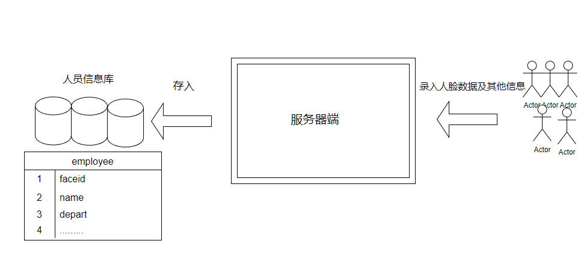
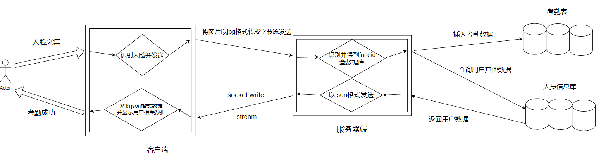
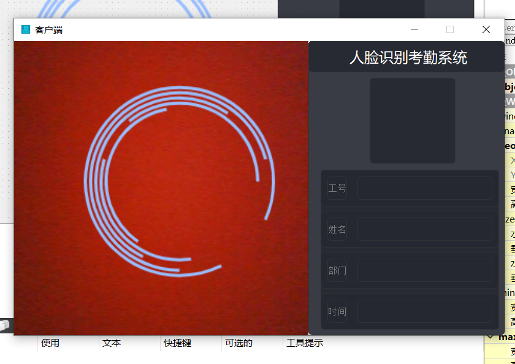
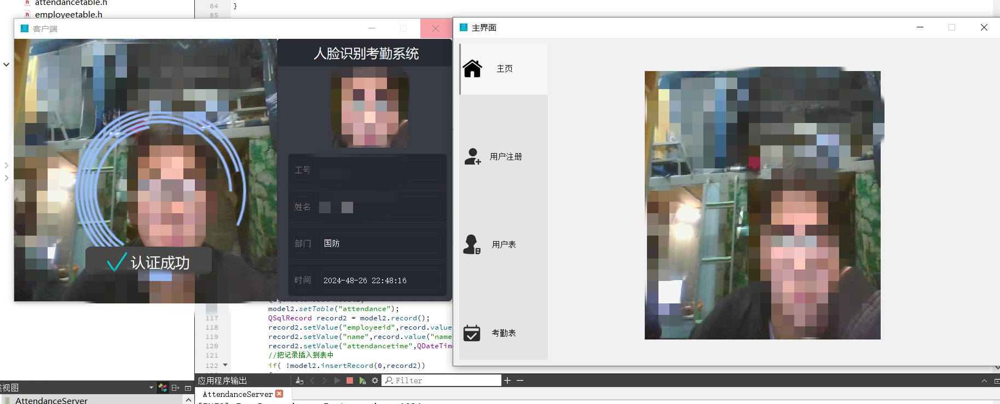
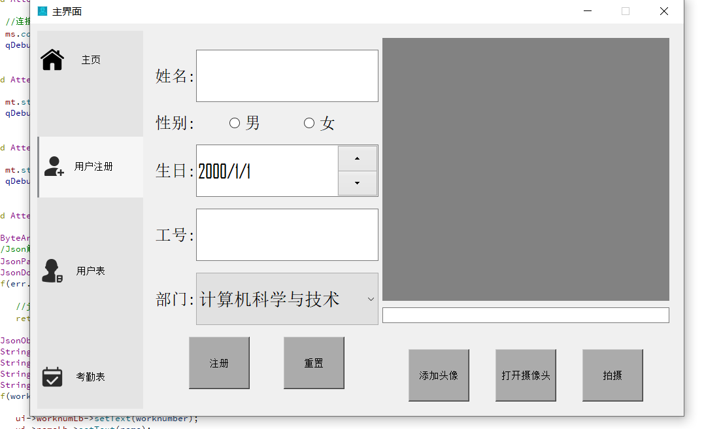
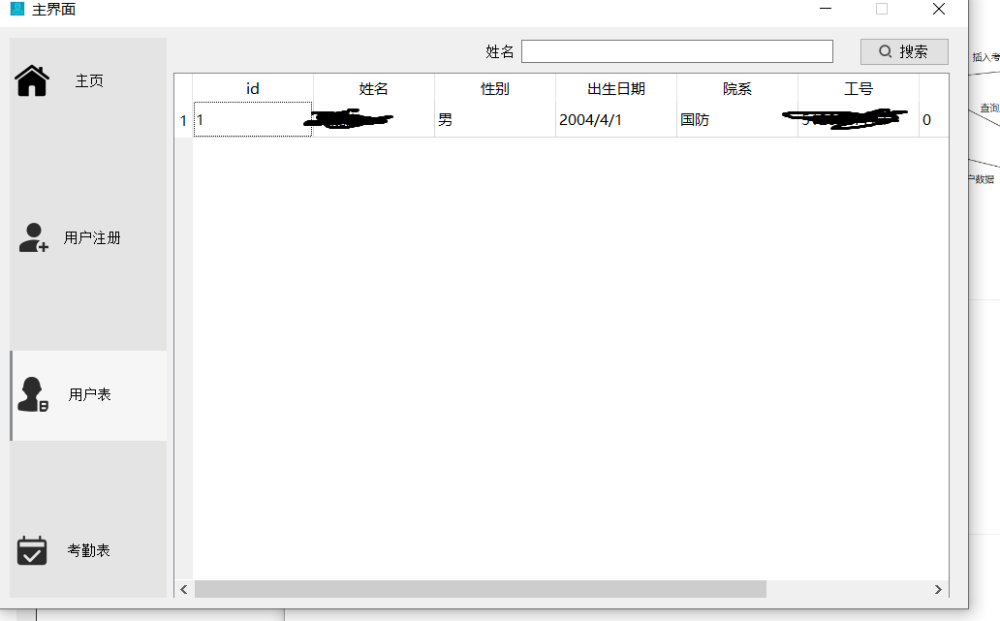
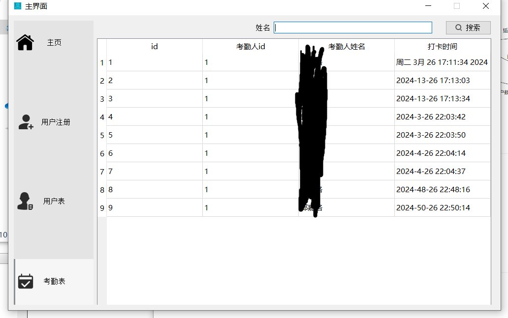
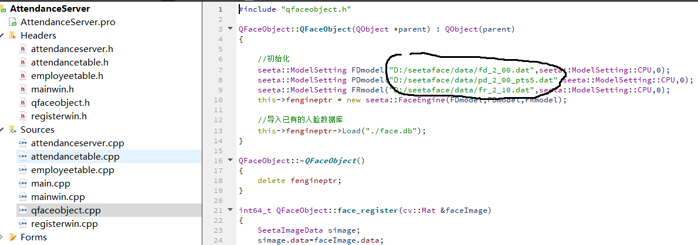
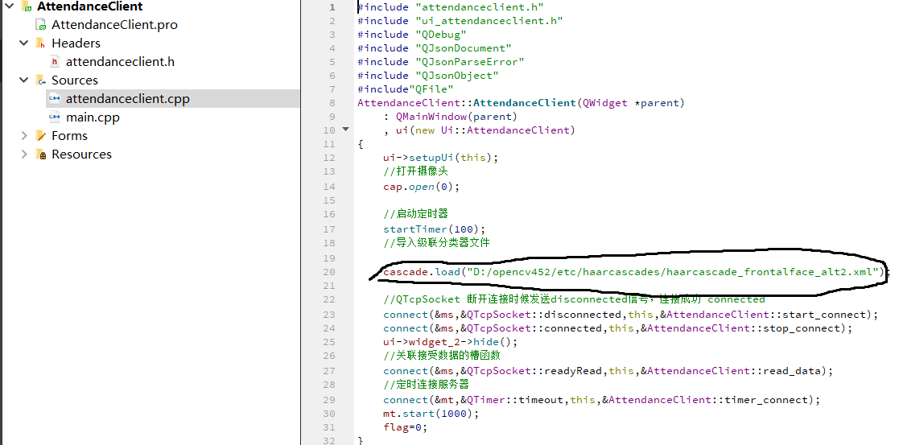

# 实验室人脸考勤系统

## 系统架构图解

## 环境

1. qt5.14.2/c++ 
2. opencv4.5.2
3. seetaface2
4. sqlite
5. win10   mingw 7.3.0 64bit 

## 运行效果图

## 项目运行

首先要编译opencv4.5.2（带contrib扩展模块）和seetaface2算法库 （以及训练好的模型数据）

参考[win10 中 OpenCV4.5.2 的安装与环境配置（含手动编译版本）（图文）_opencv 4.5.2下载-CSDN博客](https://blog.csdn.net/ZChen1996/article/details/115985925)

[图像处理：seetaface2 (一) 编译篇_cmake编译seetaface2环境配置-CSDN博客](https://blog.csdn.net/weixin_43777852/article/details/118487588)

改路径，将图中数据来源路径换成自己的

数据库文件在服务器中代码创建。